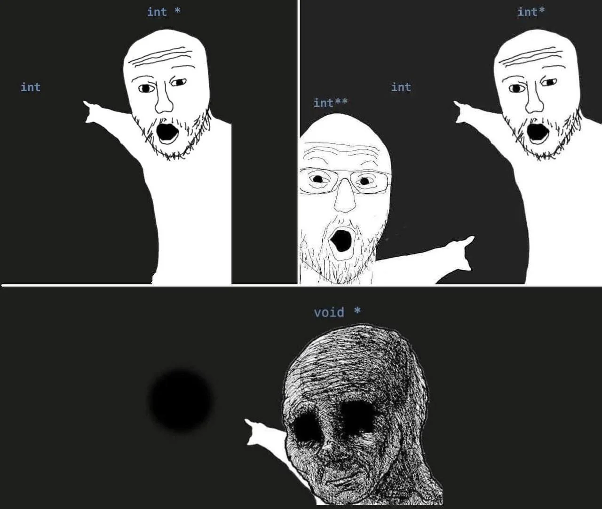

# Pred 4
<table>
    <tr>
        <td>stack</td>
    </tr>
    <tr>
        <td>heap</td>
    </tr>
    <tr>
        <td>static vars</td>
    </tr>
    <tr>
        <td>program</td>
    </tr>
</table>

stack in heap se spreminjata.
primer 1:
```c++
#include <stdio.h>
int sqr(int n)
{
    int s = n*n; //avtomatska var
    return s;
}
int n; //staticen var
int main(int argc, char *argv[])
{
    int a = 5;
    int b = sqr(a);
    printf("%d\n",b);
    return 0;
}
```

5 var
kko se var locijo? -> kje so v tej sliki
static n => 4b so rezervirani v ram vs cas izvajanja programa
var a, b sta zivi samo tolko casa, dokler se main izvaja, sepravi ceu cejt
int s => ziva dokler ne func vrne rez isto velja ta param n

param n, s, a, b so na stacku

## keywords v C
- auto
- static
- register
- extern

tldr: auto vars so na stacku, static pa v staticnih podatkih

### auto
#### v funkciji
```c++
    int n; //avtomatska spremenljivka; stack
    //ali
    auto int n; //stack
```
se ne rabi za auto racunanje var type

### static
#### v function
```c++
int n; //stack
static int n; //static data-> daj v static vars in skrij pred ostalimi enotami programa
```
raba?

```c++
    int sqr(int n)
    {
        int s = n * n;
        static int c = 0; c = c + 1;
        if (c == 100) exit(1);
        return n;
    }
```

c je med static data, zato je ziva ves cas med izvajanjem programa
static c = 0; se izvede samo ob deklaraciji, zato ob vsakem klicu se bo c povecal za 1.
ko bomo sqr funkcijo klicali 99-krat, se bi program nehu izvajat


```c++
int c  = 0;
int sqr(int n)
{
    int s = n * n;
    c = c + 1;
    if (c == 100) exit(1);
    return s;
}
```

ta dva primera sta identicna v delovanju.
V 2. primeru spremenljivko c vidijo in spreminjajo vse funkcije ki so pod njeno deklaracijo.

#### izven funkcije:
```c++
static int n; // static var, isto kot:
int n;
```

### register
v function:
```c++
int n; // v stacku
register n; // v registru
```
ce mas kk registry prost in se ti zdi ured, dej v regitry cene nrdi posvoje
je ponavad ignored


**ne mores rabiti izven funkcij**
### extern

v function
```c++
extern int n;
```
#### v function
ne takoj allocata 4b > n je declared nekje v zunanji funkciji / funkciji drugega programa (je v static delu)

#### izven funkcije
```c++
extern int n; // nekje drugje v neki drugi enoti programa
```

## Pointers and arrays


Vsak byte v ram ima svoj lasten address

```c++
int n;
int m;
int f(void)
{
    int a = 3;
    return a;
}
int main()
{
    //code here
    return 0;
}
```

```c++
int *p; // pointer na int, hrani 64b naslov
```

kaj lahko pocnem z pointerjem?

```c++
p = &n; // v p shranimo reference(mem address) od n
```

ce je n na naslovu 73A0, potem z prejsnjim ukazom v p shranis ta naslov. n = 4B, p = 8B;

```c++
printf("%p\n",p); //out: 73A0
m = *p; //v m shranimo vrednost, ki je na addressu shranjenem v p
```

vzem 64b p-ja, razumi kot naslov, bejz na naslov, poberi 32b in shrani v tisti var
& -> ref/ referenciranje
\*p -> deref/ dereferenciranje

pointerji so na stacku

```c++
int n;
int *ptr = &n;
printf("%p %p\n",ptr, ptr+3);// pozor: ptr +3 se racuna kot ptr + 3*sizeof(int)

double x;
double *ptrx = &x;
prinf("%p %p\n",ptrx, ptrx+3); //ptrx + 3*sizeof(double)
```


### uporaba pointerjev
```c++
int n = 17; // na address 73A0
scanf("%d",&n); //pri klicu posljemo reference n-ja
```

```c++
int n = 3;
//ce posiljas vrednost se static ne spremeni
int inc1(int n)
{
    n = n+1;
    return n;
}

//ce posljes reference, se static spremeni
int inc2(int *n)
{
    *n = *n + 1;
    return *n;
}

int main()
{
    int m = inc1(n); // m = 4; n = 3
    int a = inc2(&n) // a = 4; n = 4;
}
```

zelo nevarno! nimamo zagotovila, da se to izvede:
```c++
int n = inc2(&n + 3) //seg fault, komputer kaboom
```

## Arrays
tabela:
```c++
int arr[100] //100-intov, en za drugim
```

v funkciji je not karkoli, izven so not same 0

```c++
//vsi for loopi naredijo isto
for (int i = 0; i < 100; i++)
    t[i] = 2*i;
int *p = &(t[0]); // address prvega elementa v arrayu

for (int i = 0; i < 100; i++)
    p[i] = 2*i; // p[i] = i*sizeof(int);

//pozor: po koncu loopa, bo pointer kazal izven arraya
for (int i = 0; i < 100; i++)
{
    *p = 2*i
    p++;
}

*p = 17; // zapise izven arraya -> rašunalnik bum bum
p[-300] = -17 // kaboom
```